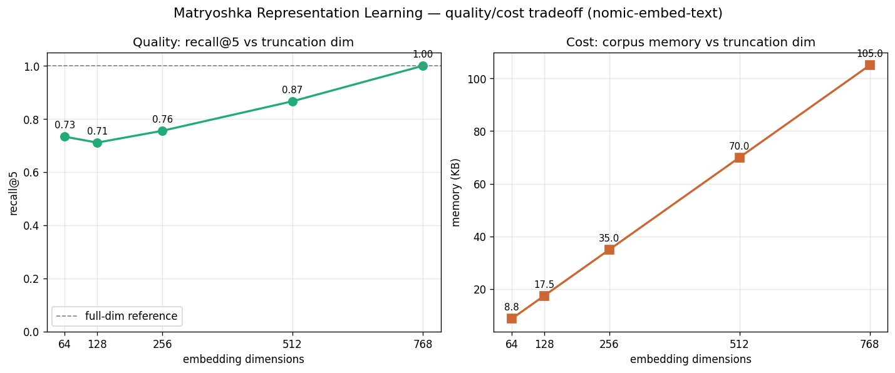

# IS02P02 — MRL Benchmarker

> "Most embedding models give you one fixed-size vector — use all 768 dimensions or none.
> Matryoshka Representation Learning changes the deal: the first *k* dimensions of an MRL
> embedding are themselves a valid, high-quality embedding. Train once. Truncate anywhere.
> Benchmark to find the smallest dimension that still meets your recall target."

A benchmark that measures, on a local `nomic-embed-text` model, **how much retrieval quality
you lose when you truncate MRL embeddings — and how much memory you save by doing so.**

---

## What this is

`nomic-embed-text` (v1.5) is trained with Matryoshka Representation Learning. That training
deliberately front-loads meaning into the *early* dimensions, so a 768-d vector contains a
usable 512-d, 256-d, 128-d, and 64-d embedding nested inside it — like Russian dolls.

This project embeds a small labelled corpus once at full dimension, then sweeps truncation
dimensions and measures three things per dimension:

- **recall@k** — quality, scored against the full-dim ranking as ground truth
- **search latency** — time to score one query against the whole corpus
- **memory** — bytes to store the truncated corpus matrix

---

## Core concepts

### Task prefixes
nomic expects the input to be tagged by purpose. Corpus items are embedded with
`search_document:` and queries with `search_query:`. Skipping this quietly degrades retrieval.

### L2 normalization
Ollama returns raw, un-normalized vectors (values well outside [-1, 1]). We scale every vector
to unit length, so **cosine similarity becomes a plain dot product** — and rankings are just
`docs @ query` followed by an argsort. Cheap and clean.

### Truncate, then RE-normalize (the MRL move)
```
truncate(vec, dim):
    head = vec[:dim]          # keep the first `dim` numbers
    return head / ||head||    # put it back on the unit sphere
```
Slicing a vector shortens it — the head no longer has length 1. **Re-normalizing after
truncation is mandatory:** without it, truncated vectors live on different-radius spheres and
their cosine scores are silently wrong. This is the single most common MRL bug. The self-test
in `bench/embed.py` proves every truncated vector has L2 norm ≈ 1.0.

### Ground truth
The reference "correct" ranking is the **full 768-d** top-k for each query. recall@k then asks:
*how many of a truncated dimension's top-k appear in the full-dim top-k?* This isolates the
truncation effect cleanly — at dim=768 recall is 1.000 by construction, which doubles as a
correctness check. A small hand-labelled sanity set confirms the full-dim reference is itself
sensible before we trust the curve.

---

## How to run

Requires a local [Ollama](https://ollama.com) serving `nomic-embed-text`:
```bash
ollama pull nomic-embed-text
```

```bash
python -m venv .venv && source .venv/bin/activate
pip install -r requirements.txt

python -m bench.embed       # self-test: truncation norms all ~1.0
python -m bench.corpus      # data-load check: 35 docs / 9 queries
python -m bench.benchmark   # the benchmark table
python -m bench.visualise   # table + saves mrl_benchmark.png
```

Config (`config.py`, override via `.env`): `OLLAMA_URL` (default `http://127.0.0.1:11434`),
`EMBED_MODEL` (default `nomic-embed-text`).

---

## Results

Corpus: 35 docs across 6 topics · 9 queries · k = 5

| dim | recall@5 | search ms | memory KB |
|----:|---------:|----------:|----------:|
|  64 |    0.733 |    ~0.003 |      8.75 |
| 128 |    0.711 |    ~0.003 |     17.50 |
| 256 |    0.756 |    ~0.005 |     35.00 |
| 512 |    0.867 |    ~0.005 |     70.00 |
| 768 |    1.000 |    ~0.005 |    105.00 |



**Read it:** at **512 dims** you keep **~87%** of full-dim quality for **2/3** the memory; at
**256 dims** — *one third* the storage — you still hold **~76%**. The knee sits between 256 and
512: quality declines gently down to 256, then there is a real gap up to full. Where you set the
dial is a recall budget, not a fixed answer.

---

## Observed

- **The curve is not perfectly monotonic** — 128 (0.711) dips slightly *below* 64 (0.733). On a
  35-doc corpus with k=5, one query swapping a single doc moves recall by ~0.02, so the low-dim
  end is within sampling noise. The trend (higher dim → higher recall, sharp gain 256→768) is
  solid; the 64-vs-128 wiggle is small-sample jitter, not a real inversion.
- **Latency is flat and sub-microsecond at every dimension.** On 35 docs the dot-product cost is
  dwarfed by overhead, so truncation buys almost nothing in *time* here. Memory is the real lever
  at this scale. Latency would diverge on a corpus of millions of vectors — the place MRL's speed
  story actually pays off.
- **Memory scales exactly linearly** (`n_docs × dim × 4` bytes, float32): 105 → 70 → 35 → 17.5 →
  8.75 KB. This is MRL's headline payoff — store 256-d instead of 768-d, cut memory by 67%.

---

## BENEATH

**Why does MRL training front-load information into the early dimensions — what actually forces
that to happen?**

A normal contrastive embedding loss only cares about the *full* vector: it pulls related pairs
together and pushes unrelated ones apart using all 768 dims at once. Nothing about that loss says
the first 64 numbers must be useful on their own.

MRL changes the *loss*, not the architecture. During training it computes the contrastive loss at
**several nested dimensions simultaneously** — e.g. at 64, 128, 256, 512, and 768 — and sums them.
To drive the 64-d loss down, the model is forced to pack as much discriminative signal as possible
into the first 64 coordinates; the next slice refines, and so on outward. The nesting is a direct
consequence of optimising every prefix at once. That is why you can slice an MRL vector and it
still works, and why slicing a normally-trained vector gives you noise: the ordinary model had no
incentive to make any prefix self-sufficient.
